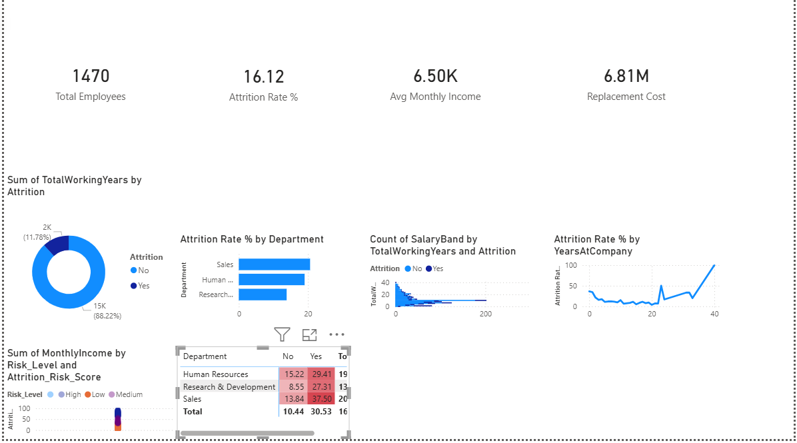
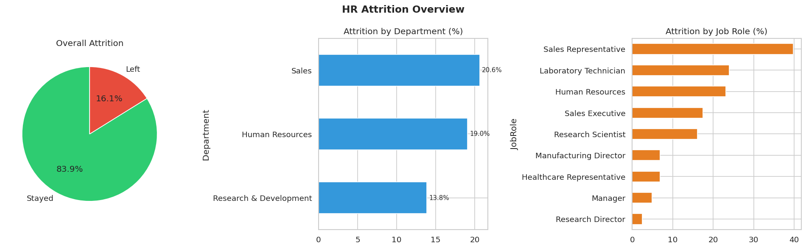
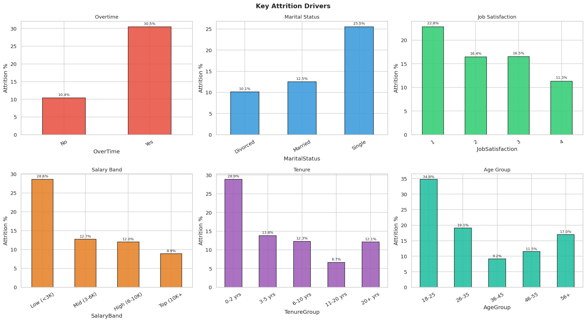
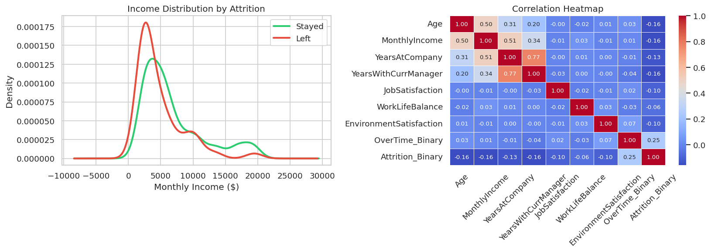
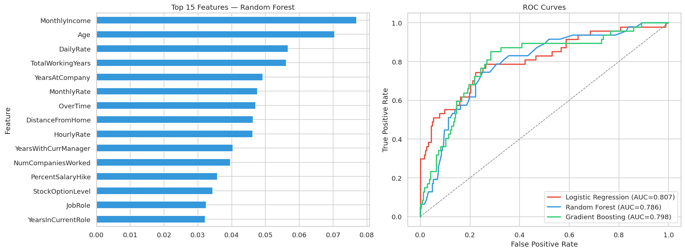

# HR Attrition Analysis & Prediction

[](https://colab.research.google.com/github/shubham-tanwar-lab/hr-attrition-analysis/blob/main/HR_Attrition_Colab_Clean%20.ipynb)
[](https://nbviewer.org/github/shubham-tanwar-lab/hr-attrition-analysis/blob/main/HR_Attrition_Colab_Clean%20.ipynb)
[](https://shubham-tanwar-lab.github.io/hr-attrition-analysis)


> End-to-end data science project on the **IBM HR Analytics dataset** — analysing why employees leave, identifying high-risk segments, and building ML models to predict attrition.

---

## Live Demo

**[View Interactive Dashboard →](https://shubham-tanwar-lab.github.io/hr-attrition-analysis)**

---

## Key Findings

| Metric | Value |
|---|---|
| Overall attrition rate | **16.1%** |
| Highest-risk department | **Sales (20.6%)** |
| Overtime attrition rate | **30.5%** vs 10.4% (no overtime) |
| Highest-risk role | **Sales Representative (~40%)** |
| Youngest cohort (18–25) attrition | **34.8%** |
| Low salary band attrition | **28.6%** vs 8.9% (top earners) |
| Estimated replacement cost | **$6.81M** |
| Best model AUC | **0.807** (Logistic Regression) |

---

## Power BI Dashboard



---

## Analysis Charts









---

## Project Structure

```
hr-attrition-analysis/
│
├── HR_Attrition_Colab_Clean .ipynb           # Full analysis notebook (Colab-ready)
├── index.html                   # Interactive dashboard (GitHub Pages)
├── README.md
│
├── 
├── powerbi_dashboard.png    # Power BI dashboard screenshot
├── chart1_overview.png      # Attrition overview — pie + bar charts
├── chart2_drivers.png       # Key drivers — 6-panel grid
├── chart3_salary_corr.png   # Income KDE + correlation heatmap
├── chart4_model_results.png # Feature importance + ROC curves
│
└── data/
    └── README.md                # Instructions to download IBM HR dataset
```

---

## Tech Stack

- **Data wrangling** — Pandas, NumPy
- **SQL analysis** — SQLite (6 queries with CTEs, window functions)
- **Visualisation** — Matplotlib, Seaborn, Power BI
- **Machine learning** — Scikit-learn (Logistic Regression, Random Forest, Gradient Boosting)
- **Dashboard** — Power BI
- **Environment** — Google Colab

---

## What the Notebook Covers

### 1. Data Cleaning & Feature Engineering
- Dropped constant-variance columns and duplicates
- Engineered 6 new features: `TenureGroup`, `AgeGroup`, `SalaryBand`, `Attrition_Binary`, `OverTime_Binary`, `IncomePerYear`

### 2. Exploratory Data Analysis
- Attrition breakdown by department, job role, overtime, marital status, age group, salary band, job satisfaction, and tenure
- Income distribution comparison (stayed vs. left)
- Correlation heatmap of key numerical features

### 3. SQL Analysis (SQLite)
- Overall attrition stats
- Department-level breakdown
- Top roles by attrition rate using window functions (`RANK() OVER PARTITION BY`)
- Promotion recency impact on churn
- Replacement cost estimation: `salary_lost × 0.5`

### 4. Machine Learning
- 3 classifiers compared with 5-fold stratified cross-validation
- Best AUC: **0.807** (Logistic Regression)
- Top predictive features: `MonthlyIncome`, `Age`, `DailyRate`, `TotalWorkingYears`, `YearsAtCompany`
- Individual risk scoring (0–100) for all 1,470 employees → segmented into High / Medium / Low risk tiers

---

## How to Run

### Option 1 — Google Colab (recommended, no setup needed)
Click the **Open in Colab** badge at the top of this page.  
Upload the IBM HR dataset when prompted. All dependencies are pre-installed in Colab.

### Option 2 — Run locally
```bash
git clone https://github.com/shubham-tanwar-lab/hr-attrition-analysis.git
cd hr-attrition-analysis
pip install pandas numpy matplotlib seaborn scikit-learn
jupyter notebook "HR_Attrition_Colab_Clean .ipynb"
```

### Dataset
Download the IBM HR Analytics dataset from [Kaggle](https://www.kaggle.com/datasets/pavansubhasht/ibm-hr-analytics-attrition-dataset) and place it in the `data/` folder as `hr_raw.csv`.

---

## Results Summary

| Model | CV AUC | Test AUC | Accuracy |
|---|---|---|---|
| Logistic Regression | ~0.81 | **0.807** | ~76% |
| Random Forest | ~0.79 | 0.786 | ~85% |
| Gradient Boosting | ~0.80 | 0.798 | ~84% |

---

## Author

**Shubham Tanwar**  
[LinkedIn](https://www.linkedin.com/in/shubham-tanwar-141bb0379) · [GitHub](https://github.com/shubham-tanwar-lab)

---

*Dataset: IBM HR Analytics Employee Attrition & Performance — available on Kaggle.*
